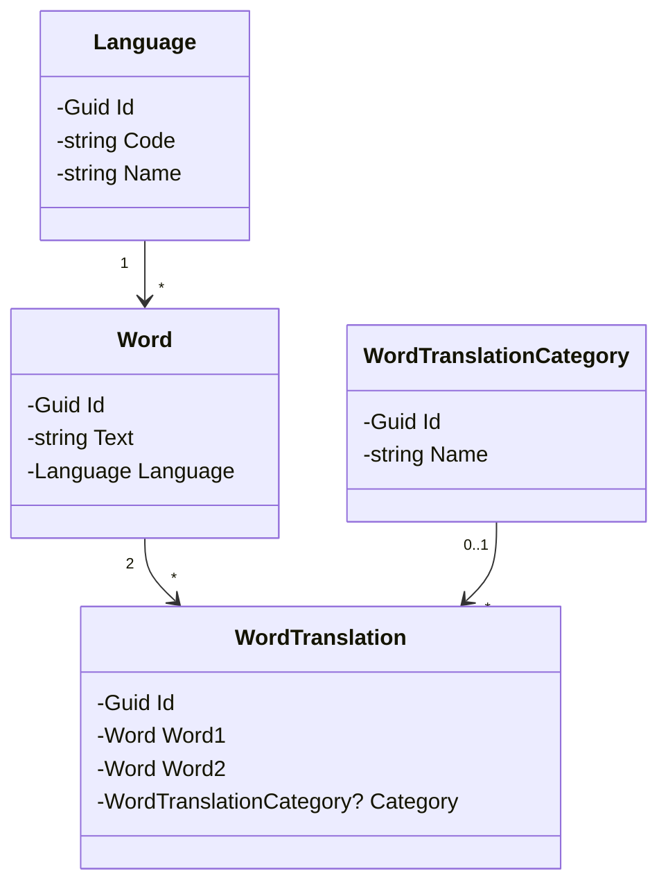

# WordsTrainer

## Datový model - Vazby mezi entitami

### Popis entit

- **Language**: Reprezentuje jazyk (např. English, Czech)
  - `id`: Identifikátor jazyka
  - `code`: Kód jazyka (e.g., "en", "cs")
  - `name`: Název jazyka

- **Word**: Slovo v určitém jazyce
  - `id`: Identifikátor slova
  - `text`: Textová hodnota slova
  - `language`: Odkaz na jazyk

- **WordTranslation**: Vazba mezi dvěma slovy jako překlad
  - `id`: Identifikátor překladu
  - `word1`: První slovo (např. anglické)
  - `word2`: Druhé slovo (např. české)
  - `category`: Volitelná kategorie překladu

- **WordTranslationCategory**: Kategorie/klasifikace překladu
  - `id`: Identifikátor kategorie
  - `name`: Název kategorie